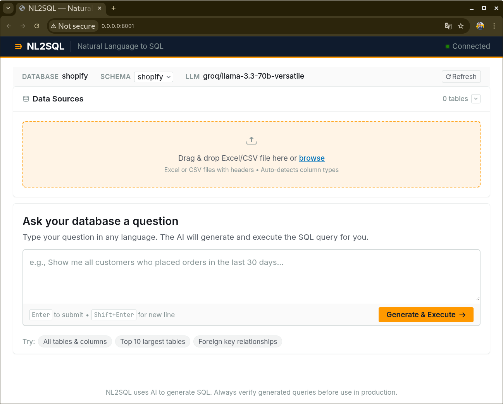
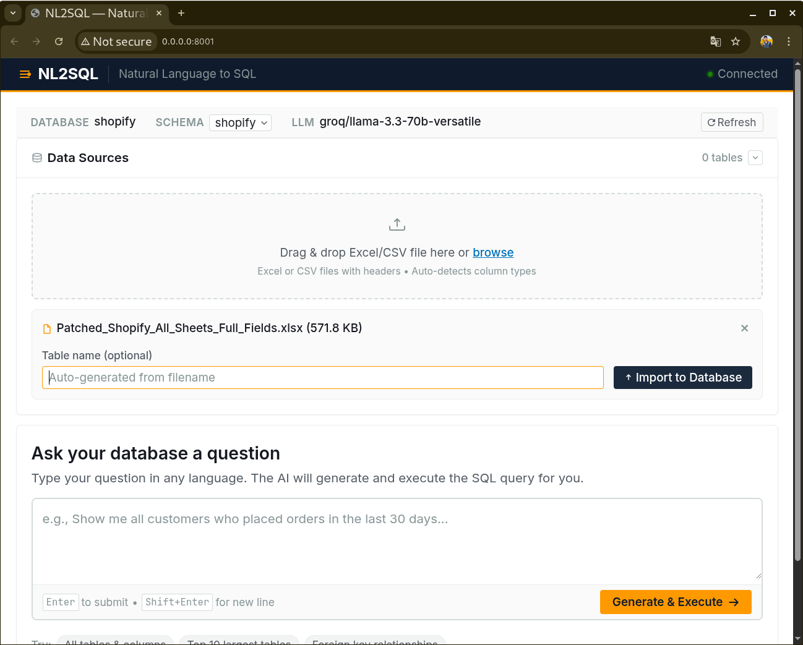
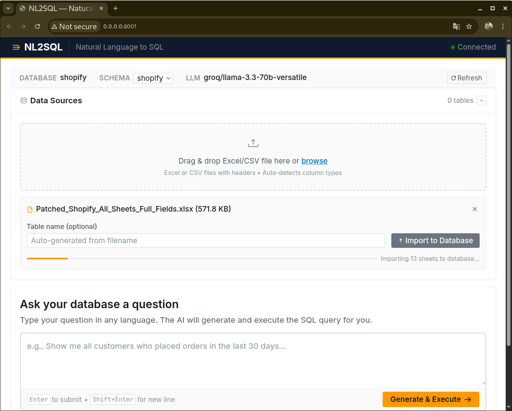
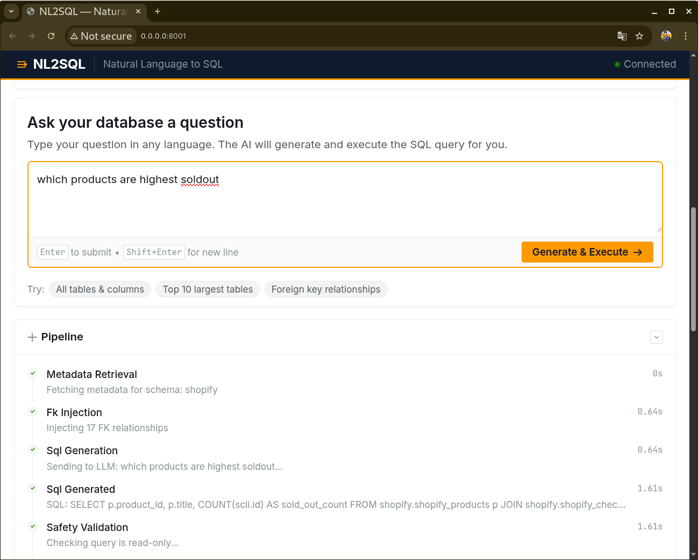
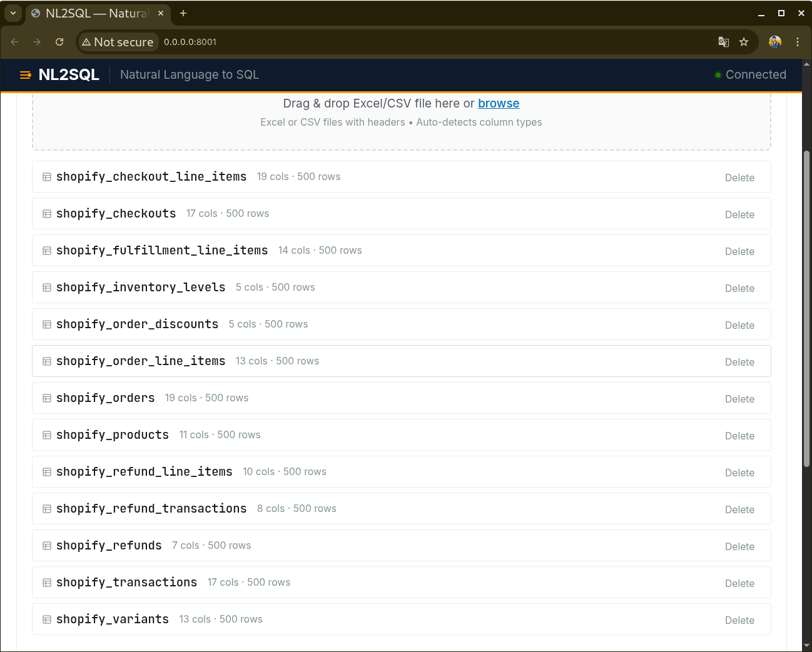
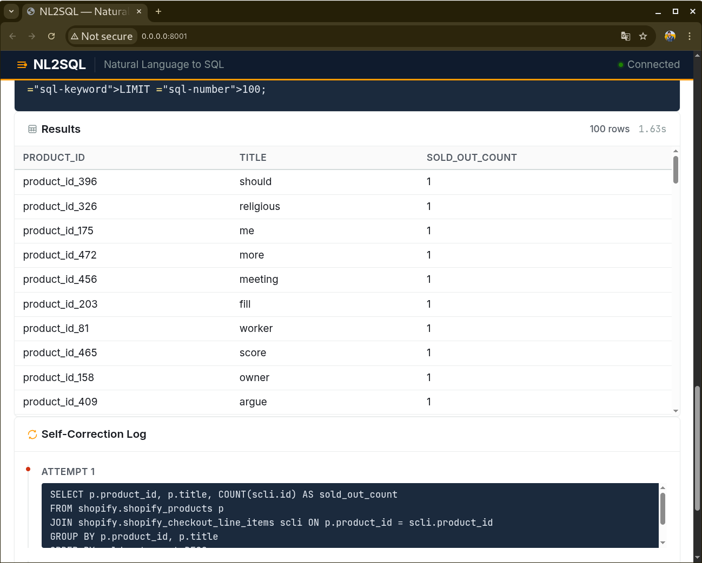
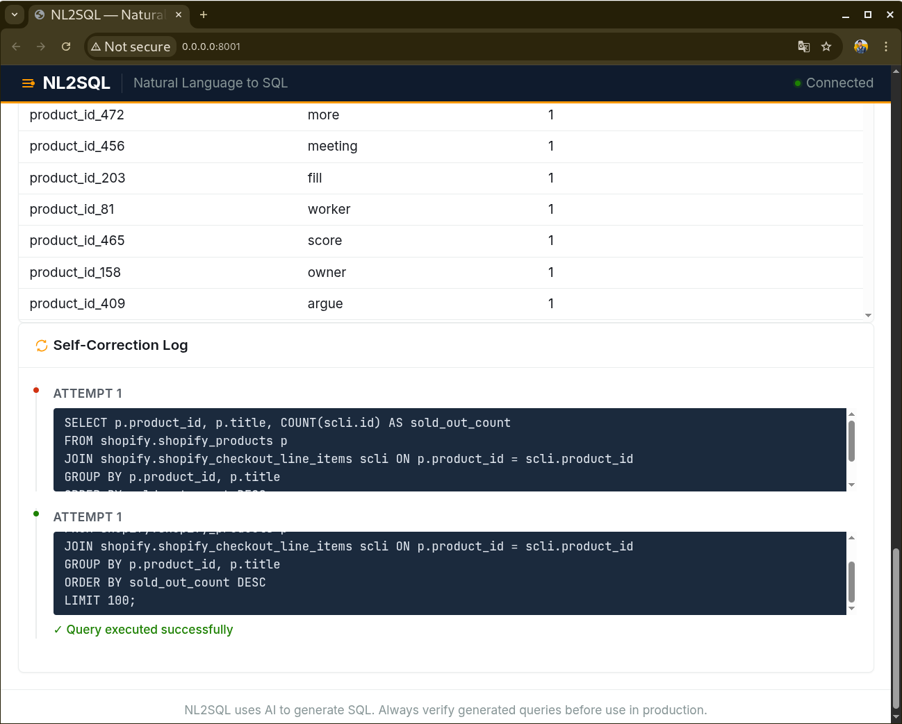

# NL2SQL Project Details

This project is a Natural Language to SQL (NL2SQL) agentic pipeline that converts a user's plain English (or Hinglish) queries into database SQL queries and displays the fetched data on the UI.

---

## 🚀 Getting Started

### 1. Environment variables (`.env`)
Create a `.env` file in the root directory of the project and add your configurations to it:
```env
# Example .env configuration
DATABASE_URL=postgresql://
GROQ_API_KEY=
GEMINI_API_KEY=

DB_HOST=localhost
DB_PORT=
DB_NAME=
DB_USER=
DB_PASSWORD=
DB_SCHEMA=
LOG_LEVEL=INFO
SAMPLE_SIZE=500
MAX_UNIQUE_VALUES=50
# Other necessary variables
```

### 2. Running PostgreSQL
To run the PostgreSQL server, open your terminal and use the following commands:

**Linux (Ubuntu/Debian):**
```bash
sudo service postgresql start
# or
sudo systemctl start postgresql
```

**Mac (Homebrew):**
```bash
brew services start postgresql
```

**Windows:**
Open `services.msc`, search for `postgresql-x64-XX`, and start it. Or run cmd/PowerShell (as Administrator):
```cmd
net start postgresql-x64-15
```

### 3. Running the Server (Uvicorn)
Use Uvicorn to start the FastAPI backend server:
```bash
uvicorn main:app --reload --host 0.0.0.0 --port 8001
```
*(You can also run the MCP server in a separate terminal using `uvicorn mcp_server:app --port 8002`).*

---

## 🏗️ Architecture

Our system is based on modular and scalable components:
- **Frontend / UI**: Where the user uploads their data (Excel/CSV) and types queries in English.
- **Backend (FastAPI)**: Orchestrates API requests and the AI agents pipeline.
- **AI Agents Pipeline**: Goes through the flow: Schema Mapper ➔ Cardinality Estimator ➔ SQL Generator ➔ Validator ➔ Executor.
- **Database (PostgreSQL)**: Dynamically creates tables to maintain relational data and constraints.

### 📸 Application Interface & Results

**Model Inference / Interface**  
<br>

<br><br>

**1. Data Upload**  


**2. Data Processing (Schema Generation)**  


**3. Natural Language Querying**  


**4. Graph Traversal (Multi-Table JOINs)**  


**5. Output Results**  


**6. SQL Query Results** 

---

## 1️⃣ Data Ingestion Flow

1. **User selects a file** (Excel `.xlsx/.xls` **or** CSV).  
2. The `uploadCSV()` function (frontend `app.js`) decides:
   * **Excel** → Triggers a `POST /upload` call and receives a `session_id`.  
   * **CSV** → Triggers a `POST /api/upload-csv` call.
3. For Excel, the frontend then calls `POST /ingest/{session_id}` which:
   * Uses **Pandas** to read all Excel sheets.
   * Creates a new table in the PostgreSQL database for each sheet name (schema.table_name) and inserts rows using **psycopg2**.
4. Once the import is finished, the UI calls `GET /api/data-tables/{schema}` to update the data sources panel (displaying table columns and row counts).  

**PK / FK handling (DSA logic in Import)**  
* When a new table is created (in `_import_dataframe_to_db`), a dynamic **CREATE TABLE** statement is generated to prepare the database schema:
  * It applies a `PRIMARY KEY` constraint to the primary identifying column (e.g. `id`).
  * For columns with names containing `_id`, it identifies them from other existing tables and applies a `FOREIGN KEY (REFERENCES other_table(id))` constraint. (Simple array iteration & string matching DSA are applied to set these constraints).
* This transforms your flat Excel/CSV files into a relational database structure.

---

## 2️⃣ How the 5 AI Agents Work (Orchestrator Pipeline)

We have divided the logic into 5 different modules/agents that work sequentially in a chain format:

1. **`schema_graph_agent.py` (The Mapper)**
   * **Role:** It creates a complete graph/network of the database by checking `information_schema` to find out which table is connected to which other table (via foreign keys).
   * **Prompt:** "Fetch table columns and FK relationships to build a complete network graph of the database schema."

2. **`cardinality_agent.py` (The Estimator)**
   * **Role:** To generate correct filters (WHERE clauses), this agent checks the unique counts and distribution of tables. For example, if a user asks for "paid orders," it checks the values to determine if the actual status is "Paid" or if the status flag is "1".
   * **Prompt:** "Analyze row counts and distinct column values for context grounding."

3. **`nl2sql_agent.py` (The Core Brain)**
   * **Role:** This is the LLM agent that takes the user's text query, schema graph, and cardinality data to write the raw SQL query. 
   * **Prompt:** "You are an expert PostgreSQL developer. Use the provided schema and hints to convert the user's natural language question into a syntactically correct SQL query. Only return valid SQL."

4. **`verification_agent.py` (The Tester)**
   * **Role:** This acts as a QA/Tester. It runs the query in a secure/rollback transaction to verify that the query is valid and doesn't throw any errors. If an error occurs, it sends the mistake back to the NL2SQL agent (self-correction).
   * **Prompt:** "The generated SQL failed with this error: [error]. Please rewrite the query ensuring column names and join conditions are correctly resolved."

5. **`orchestrator.py` (The Manager)**
   * **Role:** It runs all the above 4 agents in the correct order.
   * **Flow:** `User Query` ➔ `Schema Agent (context)` ➔ `Cardinality Agent (hints)` ➔ `NL2SQL Agent (writes SQL)` ➔ `Verification Agent (Dry Run)` ➔ `Final Execute` ➔ Result displayed on User UI.

---

## 3️⃣ How Do JOINs and GROUP BY Work?

**JOINs logic**
User data is often spread across multiple tables (e.g., Get customer name and ordered product name). This is when **Joins** are used.
With the help of the LLM Schema Graph agent, it finds the "Shortest Path" (a Graph Traversal DSA algorithm concept) from one table to another. 
Example flow: `customers.id -> orders.customer_id`, then `orders.id -> order_line_items.order_id`. The LLM converts this path into standard SQL joins (e.g. `LEFT JOIN orders o ON o.customer_id = c.id`).

**GROUP BY logic**
The agent's instructions dictate that whenever a query involves counting, minimum, maximum, or average (Aggregate functions):
* Any column that is outside the aggregates in the `SELECT` clause must have a `GROUP BY` applied to it.
* If a filter check needs to be applied on the aggregation, e.g., "sales greater than 50", the agent applies the `HAVING` clause (instead of `WHERE`).

---

## 4️⃣ Why and How Are We Using an MCP Server and Client?

**Model Context Protocol (MCP)** is an AI protocol and server that securely connects LLMs to resources, tools (functions), and contexts in a standardized way.

*   **Why use it?:** 
    1. **Decoupling:** AI logic and Database Interaction are kept completely separate. The agents do not know the database URLs/credentials; the server exposes APIs to them in the form of tools.
    2. **Resilience & Standardization:** The API interface becomes fixed (e.g. List Tables Tool, Run Query Tool). If we switch from PostgreSQL to MySQL or BigQuery in the future, only the backend MCP changes. The agents' prompts continue to work without any code modifications!

*   **How to Integrate & Install:**
    *   `mcp` is required in the `/requirements.txt` of the project's root folder, which is installed during the environment setup.
    *   **Server `mcp_server.py`:** Runs operations from the database and serves as an API server on port `8001`. We start it using Uvicorn: `uvicorn mcp_server:app --port 8001`
    *   **Client `mcp_client/client.py`:** Uses the FastAPI MCP protocol to establish contact with the server. 
    Using a `client = MCPClient("http://localhost:8002/mcp")` call, agents send their text messages down to the server via a JSON template (e.g. Action: "Execute Query"). The server performs the operation and sends the result back to the Client as JSON.
